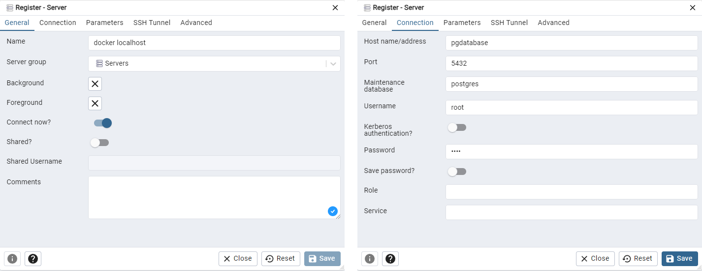
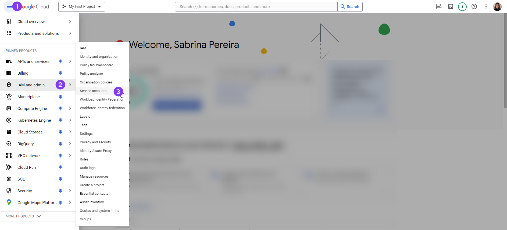

# Module 1: Notes

Setting up Docker, using PostgreSQL in Docker, downloading the datasets (diverges from the pre-recorded video lesson), using SQL to get information on the dataset and setting up Terraform.

# Docker
- build your own image: `docker build -t test:pandas .` 
  - image name is `test`
  - image tag tag is `pandas`
  - `.` look for a Dockerfile in the directory and build it.
- run your new image as container: `docker run -it test:pandas`
- to pass an argument to ap python script being executed when running the container: `docker run -it test:pandas 2021-01-15` where the date is the arg you want to pass to `pipeline.py`.

## postgreSQL in Docker
In WSL and windows, using the commands shown in the video does not work, the container does not have permission to write to the local file system. As a work around you can create a docker volume, in this case I called it `pgadmin`.

First run `docker volume create pgdata` then continue with the command given.

```
docker run -it \
  -e POSTGRES_USER="root" \
  -e POSTGRES_PASSWORD="root" \
  -e POSTGRES_DB="ny_taxi" \
  -v pgdata:/var/lib/postgresql/data \
  -p 5432:5432 \
  postgres:13
```

You can see the postgres files in the new volume using Docker Desktop:


To access the database:
- Install `pgcli` in a virtual environment
- Connect to database: `pgcli -h localhost -p 5432 -u root -d ny_taxi`

## Download the datasets
- `wget https://github.com/DataTalksClub/nyc-tlc-data/releases/download/green/green_tripdata_2019-09.csv.gz`
- `wget https://s3.amazonaws.com/nyc-tlc/misc/taxi+_zone_lookup.csv`

To upload the data we need to install a few packages in the visrtual enviroment:
- `pandas`
- `sqlalchemy`
- `psycopg2`

See [`upload-data.ipynb`](../1_intro_prereqs/code/upload-data.ipynb) for loading data to the postgres database.


## Postgres

Run Postgres and load data as shown in the videos.
We'll use the green taxi trips from September 2019:

```wget https://github.com/DataTalksClub/nyc-tlc-data/releases/download/green/green_tripdata_2019-09.csv.gz```

We will also need the dataset with zones:

```wget https://s3.amazonaws.com/nyc-tlc/misc/taxi+_zone_lookup.csv```

- [x] Download this data and put it into Postgres (with jupyter notebooks or with a pipeline)

**How complete task:** 
See jupyter notebook [`upload-data.ipynb`](../1_intro_prereqs/code/upload-data.ipynb)


## pgAdmin
```
docker run -it \
  -e PGADMIN_DEFAULT_EMAIL="admin@admin.com" \
  -e PGADMIN_DEFAULT_PASSWORD="root" \
  -p 8080:80 \
  dpage/pgadmin4
```
[Open pgAdmin](http://localhost:8080/) in the browser.

To be able to use the new pgAdmin container with our database in the postgres container, they need to be connected. For that we need to put them in the same network, as by default they are isolated. 

Once pgAdmin is running, you need to set up a server to be able to see your database (later we define a persistent volume that will remember those settings.)




## Put postgres and pgadmin in the same network

1. Create a docker network: `docker network create pg-network`
2. Add network option when running the container:
```
docker run -it \
    -e POSTGRES_USER="root" \
    -e POSTGRES_PASSWORD="root" \
    -e POSTGRES_DB="ny_taxi" \
    -v pgdata:/var/lib/postgresql/data \
    -p 5432:5432 \
    --network=pg-network \
    --name pg-database \
    postgres:13
```
3. Run pgadmin in the same network:
```
docker run -it \
    -e PGADMIN_DEFAULT_EMAIL="admin@admin.com" \
    -e PGADMIN_DEFAULT_PASSWORD="root" \
    -p 8080:80 \
    --network=pg-network \
    dpage/pgadmin4
```
We can also put these in a docker compose file, that way we don't have to have two different terminals to run the two commands separately.


## Ingestion script 

Instead of manually sending data to postgres from the jupyter notebook, we can use a python script for it. To test the script works:

```
python3 ingest_data.py \
    --user=root \
    --password=root \
    --host=localhost \
    --port=5432 \
    --db_name=ny_taxi \
    --table_name=green_taxi_trips \
    --url=https://github.com/DataTalksClub/nyc-tlc-data/releases/download/green/green_tripdata_2019-09.csv.gz
```
Now we are ready to dockerize the data ingestion. After editing the Dockerfile to use the new ingestion script and install the required dependencies, we can build the new image:

```
docker build -t taxi_ingest:v001 .
``` 

After building, we can run the pipeline with the following command:
```
docker run -it \
    --network=pg-network \
    taxi_ingest:v001 \
        --user=root \
        --password=root \
        --host=pg-database \
        --port=5432 \
        --db_name=ny_taxi \
        --table_name=green_taxi_trips \
        --url=https://github.com/DataTalksClub/nyc-tlc-data/releases/download/green/green_tripdata_2019-09.csv.gz
```

## Docker Compose

USed to start both containers (postgres and pgadmin) at the same time. Some notes:
- Since they are being generated from `docker-compose` we don't need to specify the network - they will automatically be in the same network.

pgAdmin defines a anonymous volume when using docker compose, to override this behaviour we have to name it in the docker-compose file. We also have to define it under `volumes`. The notation `pgadmin_data: {}` is used to define a named volume without any additional configuration options. Here's a breakdown of what it means:

- `pgadmin_data`: This is the name of the volume. You can refer to this name in the volumes section of your services to use this volume.
- `{}`: These curly braces represent an empty dictionary in YAML. In the context of Docker Compose, it means that you're creating a volume named pgadmin_data with the default settings.

Setting up pgAdmin with a persistent volume also persists the settings, so you don't have to create a new server each time you restart the containers.

# SQL Refresh

## Inner join

```SQL
SELECT 
    lpep_pickup_datetime,
    lpep_dropoff_datetime,
    total_amount,
    CONCAT(zpu."Borough", ' / ', zpu."Zone") as "pickup_loc",
    CONCAT(zdo."Borough", ' / ', zdo."Zone") as "dropoff_loc"
FROM
    green_taxi_trips t,
    zones zpu,
    zones zdo
WHERE
    t."PULocationID" = zpu."LocationID" AND
    t."DOLocationID" = zdo."LocationID"
LIMIT 100
```
Can also be written as:

```SQL
SELECT 
    lpep_pickup_datetime,
    lpep_dropoff_datetime,
    total_amount,
    CONCAT(zpu."Borough", ' / ', zpu."Zone") as "pickup_loc",
    CONCAT(zdo."Borough", ' / ', zdo."Zone") as "dropoff_loc"
FROM
    green_taxi_trips t JOIN zones zpu
        ON t."PULocationID" = zpu."LocationID" 
    JOIN zones zdo
        ON t."DOLocationID" = zdo."LocationID"   
LIMIT 100
```

In this query, the same zones table is used twice, aliased as `zpu` and `zdo`, to serve two different purposes: one for pickup locations and one for dropoff locations. This approach is necessary because the `green_taxi_trips` table contains two different location IDs (`PULocationID` for pickup and `DOLocationID` for dropoff), and each of these IDs needs to be joined with the zones table to retrieve the corresponding location information (borough and zone) for both pickup and dropoff.

By aliasing the zones table twice, the query can independently join:

- `PULocationID` from `green_taxi_trips` with `LocationID` in zones aliased as `zpu` (for pickup locations).
- `DOLocationID` from `green_taxi_trips` with `LocationID` in zones aliased as `zdo` (for dropoff locations).
  
This setup allows the query to correctly associate each trip with both its pickup and dropoff locations, even though the location data for both comes from the same zones table. It's a common technique in SQL to manage such relationships where multiple columns in one table need to be joined with columns in another table.

## Other

More SQL queries examples in [`modules/1_intro_prereqs/code/queries.sql`](./code/queries.sql)

**Recomendation:** [PostgreSQL vs code extension](https://marketplace.visualstudio.com/items?itemName=ckolkman.vscode-postgres) for exploring the database. Very helpful to create queries and you can also execute them, without having to open pgAdmin.

# Terraform

What it is not:
- Does not manage and update code on infrastructure
- Does not give you the ability to change immutable resources
- Not used to manage resources not defined in your terraform files

So what is it? **Infrastructure as code.** Allows you to make resources with code files.

## Key commands

- `terraform init`: get me the providers I need
- `terraform plan`: show what I am about to do without actually doing it
- `terraform apply`: do what is described in the tf files
- `terraform destroy`: remove all infra defined in the tf files
- `terraform fmt`: formats your .tf files 

## Steps
1. Create a service account
2. [Give service account the correct permissions](#setting-up-permisions-on-gcp)
3. Generate a JSON key, save it and don't forget to add to `.gitignore`
4. Run `terraform init`
5. Write [`main.tf`](./code/terraform/main.tf) file
   - Get [Google's provider](https://registry.terraform.io/providers/hashicorp/google/latest) code
   - Get code to create a new bucket in Google cloud storage service (GCS), you can find [this page](https://registry.terraform.io/providers/hashicorp/google/latest/docs/resources/storage_bucket) by googling "terraform google cloud storage bucket".
6. Run `terraform plan` to see what Terraform will do, than run `terraform apply` to create the resources defined in `main.tf`
7. Go look at your beautiful bucket [here](https://console.cloud.google.com/storage/browser).
8. Delete it by running `terraform destroy`

### Setting up permisions on GCP



Click create new service account, fill out the name and continue. For this course we need the following roles:
- Storage Admin
- BigQuery Admin
- Compute Admin

**Note:** there are very broad roles and in real life you will probably want to limit these.

## Useful links
- [How to edit service account permissions](https://youtu.be/Y2ux7gq3Z0o?feature=shared&t=199)
- [How to generate a key](https://youtu.be/Y2ux7gq3Z0o?feature=shared&t=235)
- [How to see available regions](https://cloud.google.com/compute/docs/regions-zones/viewing-regions-zones#gcloud_1)
  - Use the cloud shell to run `gcloud compute regions list` 
  - You can also filter by region, if you are in europe like me, just run `gcloud compute regions list --filter=europe` to see avaible regions

## [`main.tf`](./code/terraform/main.tf)

Some notes on resource configuration options:
- `type = "AbortIncompleteMultipartUpload"`: This action specifies that incomplete multipart uploads should be aborted when they reach the age defined in the condition. Multipart uploads are a way to upload a single object as a set of parts. If an upload is initiated but not completed, this rule will automatically abort it after it's 1 day old, potentially freeing up storage and reducing costs.