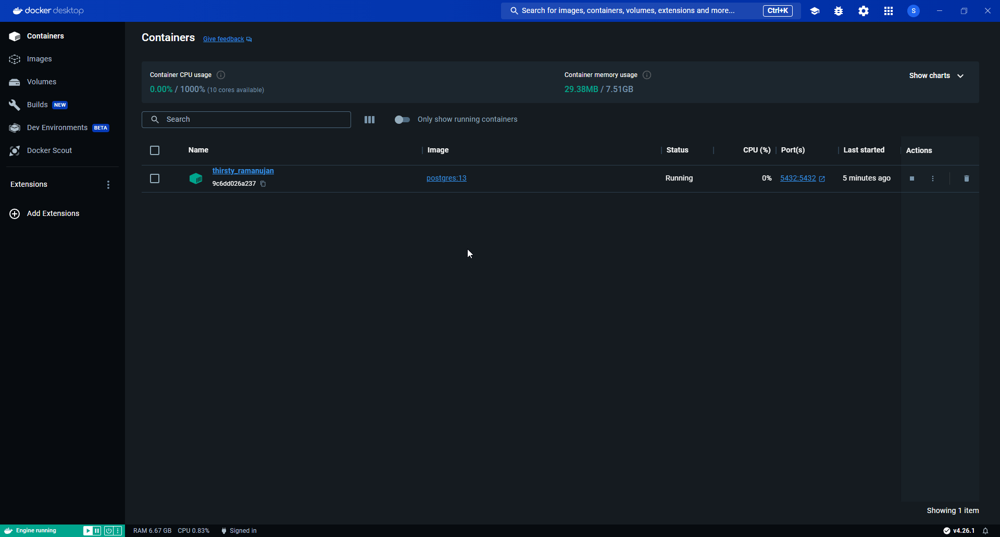

# Module 1

Setting up Docker, using PostgreSQL in Docker, downloading the datasets (diverges from the pre-recorded video lesson), using SQL to get information on the dataset and setting up Terraform.

# Docker
- build your own image: `docker build -t test:pandas .` 
  - image name is `test`
  - image tag tag is `pandas`
  - `.` look for a Dockerfile in the directory and build it.
- run your new image as container: `docker run -it test:pandas`
- to pass an argument to ap python script being executed when running the container: `docker run -it test:pandas 2021-01-15` where the date is the arg you want to pass to `pipeline.py`.

## postgreSQL in Docker
In WSL and windows, using the commands shown in the video does not work, the container does not have permission to write to the local file system. As a work around you can create a docker volume, in this case I called it `pgadmin`.

First run `docker volume create pgdata` then continue with the command given.

```
docker run -it \
  -e POSTGRES_USER="root" \
  -e POSTGRES_PASSWORD="root" \
  -e POSTGRES_DB="ny_taxi" \
  -v pgdata:/var/lib/postgresql/data \
  -p 5432:5432 \
  postgres:13
```

You can see the postgres files in the new volume using Docker Desktop:


To access the database:
- Install `pgcli` in a virtual environment
- Connect to database: `pgcli -h localhost -p 5432 -u root -d ny_taxi`

## Download the datasets
- `wget https://github.com/DataTalksClub/nyc-tlc-data/releases/download/green/green_tripdata_2019-09.csv.gz`
- `wget https://s3.amazonaws.com/nyc-tlc/misc/taxi+_zone_lookup.csv`

To upload the data we need to install a few packages in the visrtual enviroment:
- `pandas`
- `sqlalchemy`
- `psycopg2`

See `upload-data.ipynb` for loading data to the postgres database.


## Questions

### 1
Which tag has the following text? - *Automatically remove the container when it exits* 

- [ ] `--delete`
- [x] `--rc`
- [ ] `--rmc`
- [ ] `--rm`

**How to answer:** Run `docker run --help` and read the help text for different flags.

### 2
1. Run docker with the python:3.9 image in an interactive mode and the entrypoint of bash.
2. Now check the python modules that are installed ( use ```pip list``` ). 

What is version of the package *wheel* ?

- [x] 0.42.0
- [ ] 1.0.0
- [ ] 23.0.1
- [ ] 58.1.0

**How to answer:** 
1. Run the container `docker run -it python:3.9` 
2. It will download if you don't have it, 
3. You will see you go directly into python so can't use `pip`, so we have to exit it and access bash in that same container.
4. Run the container again with an entrypoint `docker run -it --entrypoint=bash python:3.9`
5. Now you can run `pip list wheel`

# Postgres

Run Postgres and load data as shown in the videos.
We'll use the green taxi trips from September 2019:

```wget https://github.com/DataTalksClub/nyc-tlc-data/releases/download/green/green_tripdata_2019-09.csv.gz```

We will also need the dataset with zones:

```wget https://s3.amazonaws.com/nyc-tlc/misc/taxi+_zone_lookup.csv```

- [x] Download this data and put it into Postgres (with jupyter notebooks or with a pipeline)

**How complete task:** 
See jupyter notebook [`upload-data.ipynb`](../1_intro_prereqs/code/upload-data.ipynb)

## Questions 

### 3. Count records 

How many taxi trips were totally made on September 18th 2019?

Tip: started and finished on 2019-09-18. 

Remember that `lpep_pickup_datetime` and `lpep_dropoff_datetime` columns are in the format timestamp (date and hour+min+sec) and not in date.

- [ ] 15767
- [ ] 15612
- [ ] 15859
- [ ] 89009


### 4. Largest trip for each day

Which was the pick up day with the largest trip distance
Use the pick up time for your calculations.

- [ ] 2019-09-18
- [ ] 2019-09-16
- [ ] 2019-09-26
- [ ] 2019-09-21


### 5. Three biggest pick up Boroughs

Consider lpep_pickup_datetime in '2019-09-18' and ignoring Borough has Unknown

Which were the 3 pick up Boroughs that had a sum of total_amount superior to 50000?
 
- [ ] "Brooklyn" "Manhattan" "Queens"
- [ ] "Bronx" "Brooklyn" "Manhattan"
- [ ] "Bronx" "Manhattan" "Queens" 
- [ ] "Brooklyn" "Queens" "Staten Island"


### 6. Largest tip

For the passengers picked up in September 2019 in the zone name Astoria which was the drop off zone that had the largest tip?
We want the name of the zone, not the id.

Note: it's not a typo, it's `tip` , not `trip`

- [ ] Central Park
- [ ] Jamaica
- [ ] JFK Airport
- [ ] Long Island City/Queens Plaza


# Terraform

In this section homework we'll prepare the environment by creating resources in GCP with Terraform.

In your VM on GCP/Laptop/GitHub Codespace install Terraform. 
Copy the files from the course repo
[here](https://github.com/DataTalksClub/data-engineering-zoomcamp/tree/main/01-docker-terraform/1_terraform_gcp/terraform) to your VM/Laptop/GitHub Codespace.

Modify the files as necessary to create a GCP Bucket and Big Query Dataset.


## Question 7. Creating Resources

After updating the main.tf and variable.tf files run:

```
terraform apply
```

Paste the output of this command into the homework submission form.


## Submitting the solutions

* Form for submitting: https://courses.datatalks.club/de-zoomcamp-2024/homework/hw01
* You can submit your homework multiple times. In this case, only the last submission will be used. 

Deadline: 29 January, 23:00 CET