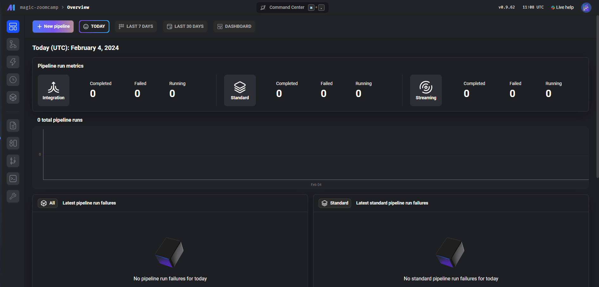
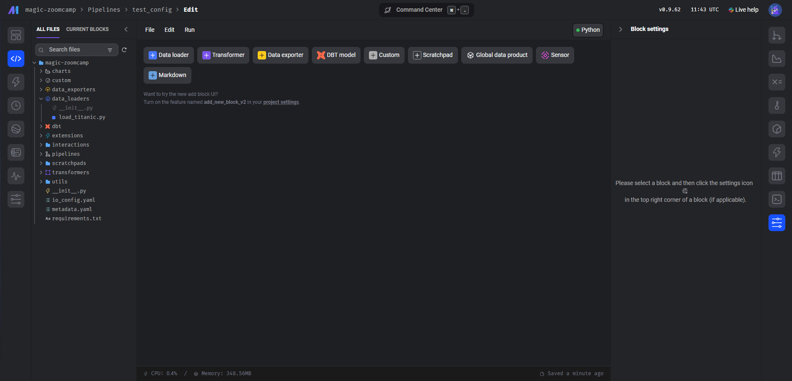
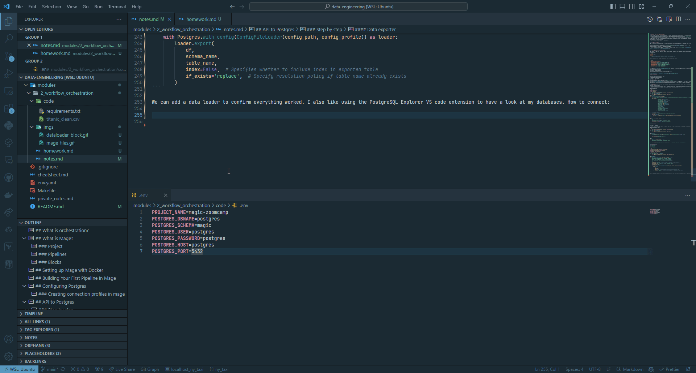
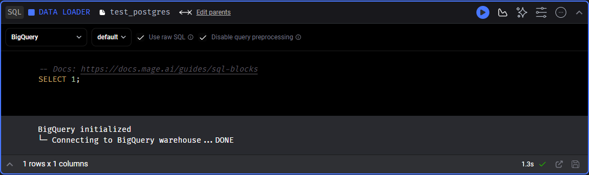
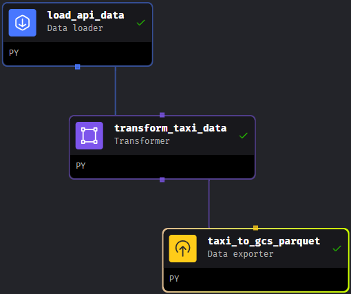
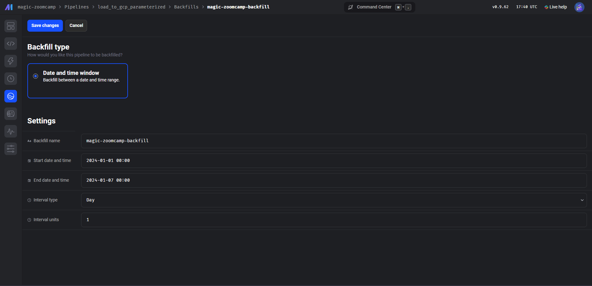

What we will be doing in this part of the course:
- How to use docker to run [Postgres](https://www.postgresql.org) with [Mage](https://www.mage.ai)
- Project: using the yellow cab dataset 🚕
  - extract the data
  - transform (clean, transform and partition)
  - load to postgres from Mage
  - load to google cloud storage
  - more transformation using: [pandas](https://pandas.pydata.org), [apache arrow](https://arrow.apache.org), SQL then load to [Google BigQuery](https://cloud.google.com/bigquery)
- Go through how to set up [Google Cloud Storage](https://cloud.google.com/storage/?hl=en) and BigQuery

## What is orchestration?
*"Orchestration is a process of dependency management, facilitated through **automation**."*

Basic idea: we want to minimise manual work.

A data orchestrator will manage:
- scheduling
- triggering
- monitoring
- resource allocation

Orchestration requires sequential steps. These workflows are also called **DAGs** (directed acyclic graphs) or pipelines.

## What is Mage?

*"An open-source pipeline tool for orchestrating, transforming, and integrating data"*

Project(Pipelines(Blocks))

### Project
-A project forms the basis for all the work you can do in Mage— you can think of it like a GitHub repo. 
- It contains the code for all of your pipelines, blocks, and other assets.
- A Mage instance has one or more projects

### Pipelines
- A pipeline is a workflow that executes some data operation— maybe extracting, transforming, and loading data from an API. They’re also called DAGs on other platforms
- In Mage, pipelines can contain Blocks (written in SQL, Python, or R) and charts. 
- Each pipeline is represented by a YAML file in the “pipelines” folder of your project.

### Blocks
- A block is a file that can be executed independently or within a pipeline. 
- Together, blocks form Directed Acyclic Graphs (DAGs), which we call pipelines. 
- A block won’t start running in a pipeline until all its upstream dependencies are met.

They contain several parts:
- Imports
- Function
- Assertion/Test

**It always returns a dataframe.**

## Setting up Mage with Docker

Instead of cloning the whole [repo](https://github.com/mage-ai/mage-zoomcamp/tree/master), I just copied the relevant files to ``.
1. Rename `dev.env` to `.env`
2. Add the `.env` file to `.gitignore`
3. Run `docker compose build`
4. Star the containers `docker compose up`
5. Access Mage GUI on http://localhost:6789

To update mage: `docker pull mageai/mageai:latest` (can take a couple of minutes for slow connections)
- Good to update as they release new versions often.
- After updating you have to rebuild the images.

## Building Your First Pipeline in Mage

- To **build a pipeline** select "New Pipeline" or use the "Pipelines" page for an overview of existing pipelines.
- Projects in Mage contain multiple pipelines. The "Magic Zoom Camp" example project contains an `example_pipeline` demonstrating basic functionality.
  - The example pipeline demonstrates reading from an API, processing data, and exporting it to a local data frame. It includes data loading, transformation, and export blocks.
- The pipeline view shows a file tree of your project and the blocks making up your pipeline. When two blocks are connected it means the dataframe outputted from one block will be moving to the next as input.
- You can execute blocks together or individually.


## Configuring Postgres

How to configure the postgres client so it can connect to the local postgres database in the docker image we built:

1. We define the postgres configuration in [`docker_compose.yml`](./code/docker-compose.yml) - 
2. Sensitive information such as database credentials are defined as environment variables are defined in the `.env` file.
3. Ensure we have a connection to the database from Mage
   1. We can do this in the Mage GUI or in VS code - the file we need here is [`io_config.yaml`](./code/magic-zoomcamp/io_config.yaml)
   


### Creating connection profiles in Mage

You can see in the  file, there is a default profile defined. But we can also define for example a "dev" profile. This is useful to separate configurations needed in dev and in production. 

```yaml
version: 0.1.1
default:
  # Default profile created for data IO access.
  # Add your credentials for the source you use, and delete the rest.
```

In the end of the file you add the following lines to create a new profile.

```yaml
dev:
  POSTGRES_CONNECT_TIMEOUT: 10
  POSTGRES_DBNAME: {{ env_var('POSTGRES_DBNAME') }}
  POSTGRES_SCHEMA: {{ env_var('POSTGRES_SCHEMA') }}
  POSTGRES_USER: {{ env_var('POSTGRES_USER') }}
  POSTGRES_PASSWORD: {{ env_var('POSTGRES_PASSWORD') }}
  POSTGRES_HOST: {{ env_var('POSTGRES_HOST') }}
  POSTGRES_PORT: {{ env_var('POSTGRES_PORT') }}  
```

💡 Mage uses [Jinja](https://jinja.palletsprojects.com) templating for interpolating environment variables (same as dbt) directly within the configuration file.

To test everything is working:
1. Create a new batch pipeline
2. Rename to *test_config*: edit > pipeline settings
3. Add SQL dataloader to pipeline to test the configuration



## API to Postgres

Building a more advanced pipeline that:
- pulls data
- performs a light transformation
- writes to data source

### Step by step
1. Create new bacth pipeline and rename it to `api_to_postgres`.
2. Create [data loader](#data-loader) to fetch data from an URL and load it using pandas (+ Data loader > Python > API)
3. Create [transformer](#transformer) block to clean/transform the data (+ Transformer > Python > Generic)
4. Create data exporter to send transformed data to postgres database (+ Data exporter > Python > PostgreSQL)

#### Data Loader
- We have to **declare** the data types for pandas. Why? Drastically reduces memory usage - makes a huge difference for memory consumption, especially for big datasets like this one (>1 million rows)
- To do this we need to first have a look at the dataset to know what are data types of each featrue in the dataset. 
- We can also explicitly tell pandas which columns include datetime so it can parse it.

Data loading block:
```py
import io
import pandas as pd
import requests
if 'data_loader' not in globals():
    from mage_ai.data_preparation.decorators import data_loader
if 'test' not in globals():
    from mage_ai.data_preparation.decorators import test

@data_loader
def load_data_from_api(*args, **kwargs):
    url = 'https://github.com/DataTalksClub/nyc-tlc-data/releases/download/yellow/yellow_tripdata_2021-01.csv.gz'
    
    taxi_dtypes = {
                    'VendorID': pd.Int64Dtype(),
                    'passenger_count': pd.Int64Dtype(),
                    'trip_distance': float,
                    'RatecodeID':pd.Int64Dtype(),
                    'store_and_fwd_flag':str,
                    'PULocationID':pd.Int64Dtype(),
                    'DOLocationID':pd.Int64Dtype(),
                    'payment_type': pd.Int64Dtype(),
                    'fare_amount': float,
                    'extra':float,
                    'mta_tax':float,
                    'tip_amount':float,
                    'tolls_amount':float,
                    'improvement_surcharge':float,
                    'total_amount':float,
                    'congestion_surcharge':float
                }

    # native date parsing 
    parse_dates = ['tpep_pickup_datetime', 'tpep_dropoff_datetime']

    return pd.read_csv(
        url, sep=',', compression='gzip', dtype=taxi_dtypes, parse_dates=parse_dates
        )


@test
def test_output(output, *args) -> None:
    """
    Template code for testing the output of the block.
    """
    assert output is not None, 'The output is undefined'
```

#### Transformer

To clean up the data:
- Remove rows with passenger count = 0 (doesn't make sense to have a taxi ride with no pessenger, so we remove the anomalous data)

Data transformation block:
```py
if 'transformer' not in globals():
    from mage_ai.data_preparation.decorators import transformer
if 'test' not in globals():
    from mage_ai.data_preparation.decorators import test


@transformer
def transform(data, *args, **kwargs):
    print('Preprocessing: rows with zero passangers:', data['passenger_count'].isin([0]).sum())

    return data[data['passenger_count'] > 0]


@test
def test_output(output, *args) -> None:
    """
    Template code for testing the output of the block.
    """
    assert output['passenger_count'].isin([0]).sum() == 0, 'There are rides with zero passangers.'
```

#### Data exporter
Update values for:
- `schema_name`
- `table_name`
- `config_profile`

```py
from mage_ai.settings.repo import get_repo_path
from mage_ai.io.config import ConfigFileLoader
from mage_ai.io.postgres import Postgres
from pandas import DataFrame
from os import path

if 'data_exporter' not in globals():
    from mage_ai.data_preparation.decorators import data_exporter


@data_exporter
def export_data_to_postgres(df: DataFrame, **kwargs) -> None:
    """
    Template for exporting data to a PostgreSQL database.
    Specify your configuration settings in 'io_config.yaml'.

    Docs: https://docs.mage.ai/design/data-loading#postgresql
    """
    schema_name = 'ny_taxi'  # Specify the name of the schema to export data to
    table_name = 'yellow_cab_data'  # Specify the name of the table to export data to
    config_path = path.join(get_repo_path(), 'io_config.yaml')
    config_profile = 'dev'

    with Postgres.with_config(ConfigFileLoader(config_path, config_profile)) as loader:
        loader.export(
            df,
            schema_name,
            table_name,
            index=False,  # Specifies whether to include index in exported table
            if_exists='replace',  # Specify resolution policy if table name already exists
        )
```

We can add a data loader to confirm everything worked. I also like using the [PostgreSQL Explorer VS Code extension](https://marketplace.visualstudio.com/items?itemName=ckolkman.vscode-postgres) to have a look at my databases. 

This is how to connect it:




## Configuring GCP

From you [Google Cloud console](https://console.cloud.google.com/welcome):

1. Create [Storage Bucket](https://console.cloud.google.com/storage) 📌 bucket names here have to be globally unique.
1. Create [Service Account](https://console.cloud.google.com/iam-admin/serviceaccounts) - for the purpose of this tutorial go with the more generous permission of the role 'Owner'
2. Create a key for the new service account (select JSON as the key type)
3. Copy saved JSON into the mage directory (in this repo that is [`modules/2_workflow_orchestration/code`](./code)) - docker will mount this file into the volume and we will be able to use it to connect to Google Cloud.
4. In the MAge GUI or VS Code, we go back to the [`io_config.yaml`](./code/magic-zoomcamp/io_config.yaml) file
   - Instead of pasting the config directly in the file, we will use the JSON file.
   - As the file is in the mounted volume, we need to set the path accordingly: ```GOOGLE_SERVICE_ACC_KEY_FILEPATH: "/home/src/enhanced-bonito-411221-42d6c353c42e.json"```
5. Test the connection to Google Cloud:
   - **BigQuery:** editing the `test_postgres` data loader block like this, and run the block:
   
   - **Bucket:** This is a little more involved. We will use the Titanic dataset in the `example_pipeline` to do this.
     1. Drag the [`titanic_clean.csv`](./code/titanic_clean.csv) file into the bucket  
     2. Create a new data loader (+ Data loader > Python > Google Cloud Storage) and rename it `test_gcs`
     3. Edit `bucket_name` and `object_key` in line 22 and 23 then run the block.
        ```py
        bucket_name = 'your-bucket-name'
        object_key = 'titanic_clean.csv'
        ```

## ETL: API to GCS

Now we will write data to Google Cloud Storage instead of Postgres.

1. Start with a new batch pipeline
2. In mage we can re-use blocks we already have without code duplication, so here we can just drag `load_api_data` to reuse the block in this new pipeline.
3. Also drag `transform_taxi_data` and make sure to connect the blocks
4. Now we just write a new exporter to send data to GCS (+ Data exporter > Python > Google Cloud Storage) and name it `taxi_to_gcs_parquet`
5. Connect the data exporter to the transformation block then run it with "execute with all upstream blocks"  

6. Go to your bucket and check out the new parquet file you created with this pipeline.

### Partitioning data with PyArrow

We don't want to be writing just one big file for all our data, so we are going to partion them. This means we will break them up by a row a characteristic - we can also partion by date because it creates an even distribution and is an usual way of querying data, making it easier to access. 

💡 A big advantage of using PyArrow is abstracting the logic of chuncking the data - instead writing it yourself, the `write_to_dataset` method allows you to just define how to partion and handles everything for you.

1. Create new data loader `taxi_to_gcs_partitioned_parquet` (+ Data exporter > Python > Generic) and connect it directly to the transformer block

```py
import pyarrow as pa
import pyarrow.parquet as pq 
import os 


if 'data_exporter' not in globals():
    from mage_ai.data_preparation.decorators import data_exporter

os.environ['GOOGLE_APPLICATION_CREDENTIALS'] = '/home/src/keys.json'


bucket_name = 'your_bucket'
project_id = 'your_project_id'
table_name = 'nyc_taxi_data'
root_path = f'{bucket_name}/{table_name}'

@data_exporter
def export_data(data, *args, **kwargs):
    # create date column from datetime colum to use to partion the data
    data['tpep_pickup_date'] = data['tpep_pickup_datetime'].dt.date

    # read dataframe into pyarrow table
    table = pa.Table.from_pandas(data)

    # defining this object allows automacally access out environment variables
    gcs = pa.fs.GcsFileSystem()

    # write dataset as partitioned parquet in GCS
    pq.write_to_dataset(
        table,
        root_path=root_path,
        partition_cols=['tpep_pickup_date'],
        filesystem=gcs
    )
```
## Parameterized Execution

What is it? Running a pipeline with a dependency on a variable, a date for example.

Parameterized execution refers to running a data pipeline where certain aspects of the execution are controlled by parameters that are passed at runtime. This allows for greater flexibility and dynamic behaviour in the data workflow. For example, a parameter could dictate which subset of data to process (such as a specific date range), the output location for exporting the data, or any other aspect of the job that might vary from one execution to another.

It is crucial for handling tasks such as incremental data loads, processing data for specific time periods, or generating reports for varying business parameters. It enables pipelines that are reusable and adaptable without hard-coded values so there is no need to create multiple versions of the same pipeline for different scenarios.

### Creating a new parameterized pipeline

1. Clone pipeline from lat video by right clicking it and clicking "Clone"
2. Rename it to `load_to_gcp_parameterized`
3. Delete the connections from `taxi_to_gcs_partitioned_parquet`, then delete the block from the cloned pipeline (this won't delete the block from the project, just from the current pipeline)
4. Create a new exporter named `export_taxi_to_gcp_parameter` 
5. Copy the code from `taxi_to_gcs_parquet` for editing ⚠️ Changing code in one block, changes it for every pipeline - so be careful when editing blocks. 


We can use kwargs to get access to runtime variables, try it out with:
```py
now = kwargs.get('execution_date')
print(now)
print(now.date())
print(now.day)
print(now.strftime("%Y/%m/%d")) # could generate file path from date 
```

Full script to upload today's taxi trips to GCS:

```py
from mage_ai.settings.repo import get_repo_path
from mage_ai.io.config import ConfigFileLoader
from mage_ai.io.google_cloud_storage import GoogleCloudStorage
from pandas import DataFrame
from os import path

if 'data_exporter' not in globals():
    from mage_ai.data_preparation.decorators import data_exporter


@data_exporter
def export_data_to_google_cloud_storage(df: DataFrame, **kwargs) -> None:
    """
    Template for exporting data to a Google Cloud Storage bucket.
    Specify your configuration settings in 'io_config.yaml'.

    Docs: https://docs.mage.ai/design/data-loading#googlecloudstorage
    """

    now = kwargs.get('execution_date')
    now_fpath = now.strftime("%Y/%m/%d") 

    config_path = path.join(get_repo_path(), 'io_config.yaml')
    config_profile = 'default'

    bucket_name = 'your_bucket'
    object_key = f'{now_fpath}/daily-trips.parquet'

    print(object_key) # just chekcing the path

    GoogleCloudStorage.with_config(ConfigFileLoader(config_path, config_profile)).export(
        df,
        bucket_name,
        object_key,
    )
```

### Setting variables in Mage UI

**Global variables** in a data pipeline are constants that remain unchanged throughout the execution of the pipeline, providing a fixed reference for settings or configurations applicable across all runs.

**Runtime variables** are dynamic and can change with each execution of the pipeline. They allow for customization based on external inputs, conditions at the time of execution, or specific processing requirements for that run.


## Backfills

If you had missing data or lost some data and now need to re-run the pipeline, for multiple days/months/etc 

In a typical system you need to write a script to backfill the data for the missing dates. Mage has an options to easily deal with this.

This is going to:
- Create a 8 runs (last date is inclusive)
- It will assign the execution date variable to each day in the interval specified



## Git

Some notes on commiting mage code to any version control:
- the `mage_data` directory should be excluded (the generated `.gitignore` file includes `mage_data`, but as it is outside of the project folder it's not actually ignored - so make sure to make the modifications necessary to exclude it).
- `io_config.yaml` should be committed, but you should not put plaintext of sensitive data in it.
- `.ssh_tunnel` is not included in the .gitignore file generated by mage, but should also be excluded
- 
I'm unsure if that's all, but it's what I'm sticking with for now.

## Deployment

How to deploy mage to Google Cloud using Terraform.

### Prerequisites 
- Terraform
- gcloud CLI
- Google Cloud Permissions
- Mage Terraform Templates

### Permissions

Permissions needed for deployment:
- Artifact Registry Read
- Artifact Registry Writer
- Cloud Run Developer
- Cloud SQL Admin
- Service Account Token Creator

### Terraform deployment to GCP

- Download the [Mage Terraform templates for GCP](https://github.com/mage-ai/mage-ai-terraform-templates/tree/master/gcp)
  - But you need to delete `load_balancer.tf`
  - and comment out lines 166 to 168 in `main.tf` 
- Update the values in the `variables.tf` files (and add it to .gitignore?)
- Run `gcloud auth application-default login` and click the link to authenticate.
- Make sure to manually enable the following APIs:
    - Cloud Filestore API 
    - Serverless VPC Access API
- From the directrory containing the Terraform templates:
  - Run `terraform init` to install all modules required by this configuration,
  - then run `terraform plan`.
  - It will ask you for the postgres password - just use the same as one as in the `.env` file.
  - Now run `terraform apply` and follow the prompts to deploy.
  - It will take forever... 
  - Check [Cloud Run](https://console.cloud.google.com/run) and you should see your new service there.
    - However, if you go to the URL, you will get a "Page not found" error, to fix it just follow the instructions [here](https://youtu.be/0YExsb2HgLI?feature=shared&t=53).

To remove all resources you just created, just use `terraform destroy`. You will need to run it twice ☺️

More information on deploying to GCP on the Mage documentation [here](https://docs.mage.ai/production/deploying-to-cloud/gcp/setup).
